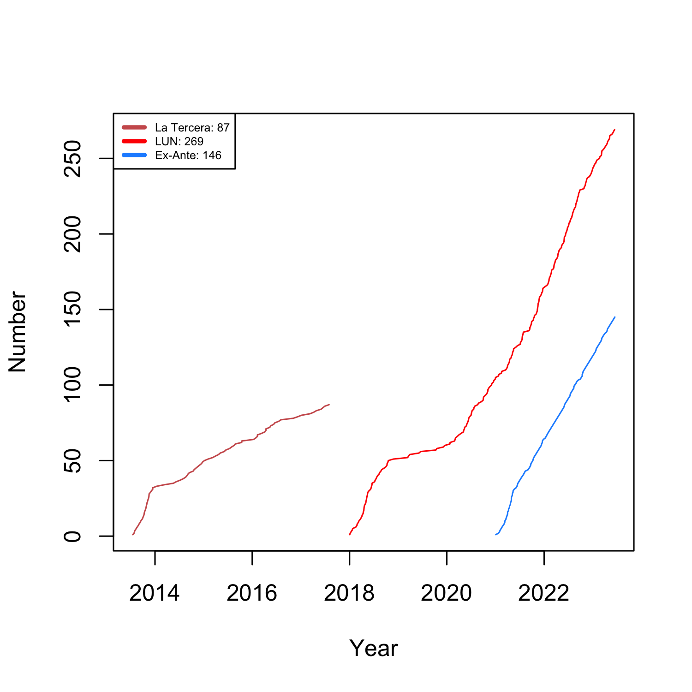

<h1>Columns</h1>

---

*Below are some of my columns published in [Las Últimas Noticias](https://en.wikipedia.org/wiki/Las_%C3%9Altimas_Noticias), [Ex-Ante](https://www.ex-ante.cl/), [T13](https://es.wikipedia.org/wiki/Teletrece), and [La Tercera](https://en.wikipedia.org/wiki/La_Tercera). For a collection of my comments in the international press, click [here](https://kennethbunker.github.io/press). For a collection of my comments in the Chilean press, click [here](https://kennethbunker.github.io/prensa). To see some of my printed press front page appearances, click [here](https://kennethbunker.github.io/covers).*

---

## Las Últimas Noticias

[*Las Últimas Noticias*](https://www.lun.com)

- 20230203 - Intenciones.docx
- 20230127 - Trapos al sol.docx
- 20230124 - Desprolijos.docx
- 20230114 - Ajuste de cuentas.docx
- 20230110 - Espectaculo político
- 20230104 - La demanda es corto plazo
- 20221231 - Incentivo a la violencia
- 20221228 - Las funas
- 20221224 - Puesta en escena
- 20221220 - Oportunidad perdida
- 20221214 - Todo lo contrario
- 20221207 - Sin salida
- 20221121 - Todo para nada
- 20221116 - Escalada de violencia
- 20221114 - Parisi y el PDG
- 20221110 - Partido circunstancial
- 20221107 - La victoria de Mirosevic
- 20221105 - Un partido de irrelevancias
- 20221029 - El proceso constituyente al congelador
- 20221027 - Señal de debilidad
- 20220925 - La gira a Nueva York
- 20220924 - Bien encaminados
- 20220918 - Convencionales anónimos
- 20220916 - Colapso absoluto
- 20220914 - Escuchar a la gente
- 20220909 - La transición
- 20220907 - En la dirección correcta
- 20220905 - Un nuevo proceso
- 20220901 - Silencio selectivo
- 20220828 - El motivo del telefonazo
- 20220826 - Irreversible
- 20220825 - Giro en 180 grados
- 20220818 - La Cancillería
- 20220812 - Mal hecha
- 20220809 - Horario laboral
- 20220804 - Pasarse tres pueblos
- 20220802 - Los buenos
- 20220730 - Cero aprendizajes
- 20220727 - No todo vale
- 20220721 - Millones de verdades
- 20220716 - El proceso continúa
- 20220714 - Una justicia para todos
- 20220706 - La voz de la razón
- 20220705 - El Chile profundo
- 20220701 - Indolencia política
- 20220625 - Scanner
- 20220623 - Torpezas
- 20220620 - Ocho ideas
- 20220615 - Expertos en excluir
- 20220611 - Meritocracia
- 20220610 - Vientos de cambio
- 20220602 - Acciones y no palabras
- 20220601 - Una verguenza
- 20220531 - La falta de certezas
- 20220530 - El trecho final
- 20220526 - Punto de no retorno
- 20220517 - Reflejos involuntarios
- 20220512 - Inconsistencia
- 20220511 - El otro jefe
- 20220430 - Los caminos a la nueva Constitución
- 20220423 - Totalitarismo
- 20220420 - Fuera de control
- 20220416 - En defensa del Senado
- 20220414 - Una jugada precisa
- 20220413 - Vuelta de carnero
- 20220330 - La violencia
- 20220325 - Impunidad
- 20220323 - Favores
- 20220318 - Responsabilidad fiscal
- 20220318 - Mario Marcel
- 20220316 - Dialogo
- 20220312 - Una oportunidad
- 20220225 - Uno mas uno es cero
- 20220223 - Una mala idea
- 20220219 - Derecho a dignidad
- 20220216 - La hora de la verdad
- 20220210 - El peligro del Rechazo
- 20220207 - Fin de una era
- 20220206 - La lista de los subsecretarios
- 20220202 - El camino peruano
- 20220130 - Diez claves del nuevo gabinete
- 20220122 - Quiebre a la tradición
- 20220106 - La novena es la vencida
- 20211223 - Señales de moderación
- 20211221 - Diez temas de la elección
- 20211220 - Legitimidad
- 20211214 - Los movilizados
- 20211211 - La ley del que grita más fuerte
- 20211127 - Capital humano
- 20211125 - Las raíces
- 20211123 - Diez resultados de la elección
- 20211117 - Preferencias variables
- 20211116 - Un debate incierto
- 20211115 - Doce temas de la elección
- 20211113 - Compromiso irrestricto
- 20211111 - La saña
- 20211110 - Socialdemocracia
- 20211105 - El estándar
- 20211102 - Ganar por ganar
- 20211020 - Octubre contra Noviembre
- 20211019 - Detener las banalidades
- 20211013 - El fin justifica los medios
- 20211012 - La gran tragedia
- 20210929 - Demasiado tibio
- 20210928 - La sospecha
- 20210925 - Los incentivos
- 20210921 - Deterioro
- 20210916 - Una cuerda delicada
- 20210915 - Los dos tercios
- 20210910 - Responsabilidad histórica
- 20210729 - Un sistema inestable
- 20210727 - Una comuna con futuro
- 20210724 - La revancha
- 20210721 - Una salida elegante
- 20210720 - La alegoría de las redes sociales
- 20210719 - El carpetazo
- 20210713 - Promesas de libertad
- 20210707 - Problema político
- 20210705 - Instalación constituyente
- 20210614 - Batalla de las izquierdas
- 20210602 - El último discurso
- 20210517 - Una nueva fuerza
- 20210516 - Llegar a acuerdos
- 20210511 - No son todos iguales
- 20210508 - Notable abandono de deberes
- 20210506 - La estrategia de Yasna
- 20210430 - Error de cálculo
- 20210428 - Situación delicada
- 20210417 - Trapos sucios
- 20210416 - Cuotas de poder
- 20210414 - Populismo
- 20210408 - La mesa de trabajo
- 20210402 - Poder municipal
- 20210331 - Improvisación permanente
- 20210326 - Nadie sobra
- 20210318 - La ave fénix
- 20210216 - Barco a la deriva
- 20210215 - Luces y sombras
- 20210126 - Frei Montalva
- 20210123 - La contradicción de RN
- 20210101 - Inconsecuencia
- 20201230 - El trabajo dignifica
- 20201219 - En sus marcas
- 20201216 - Gravedad extrema
- 20201204 - Más pequeno, menos influyente
- 20201202 - Chiste repetido
- 20201120 - Una oportunidad
- 20201111 - Seriedad, honorables
- 20201105 - Señal de renovación
- 20201104 - Victorias espurias
- 20201031 - Una deuda moral
- 20201026 - Una nueva etapa
- 20201014 - Chile falló menos
- 20201001 - Pacto fallido
- 20200930 - El tango presidencial
- 20200917 - Lapidario
- 20200826 - La carreta delante de los bueyes
- 20200820 - Modernizar con responsabilidad
- 20200729 - La defensa
- 20200723 - El plan
- 20200721 - El gesto perfecto
- 20200709 - Una oportunidad
- 20200706 - Cambio de rumbo
- 20200703 - Más que la madre de la presidenta
- 20200701 - Un gobierno más pragmático
- 20200619 - Pensar a largo plazo
- 20200614 - La hora de convocar y escuchar
- 20200612 - El informante
- 20200609 - La belleza del debate
- 20200604 - Buena decisión
- 20200530 - Llegó el momento
- 20200527 - Con el viento a favor
- 20200514 - El sheriff virtual
- 20200512 - Prudencia
- 20200507 - La partida de Mick Jagger
- 20200505 - Una maquina necesaria
- 20200417 - Fibre moral
- 20200401 - Falta de compromiso
- 20200320 - El parto constitucional
- 20200307 - La mayoría silenciosa
- 20200303 - Presunción de inocencia
- 20200229 - Cubillos
- 20200126 - La sombra de Frei
- 20200124 - Impuesto Millennial
- 20191216 - El poder real de los alcaldes
- 20191206 - Carabineros
- 20191019 - La teoría del iceberg
- 20191011 - La falla de San Ramón
- 20190619 - La teleserie socialista
- 20190328 - Mucho ruido pocas nueces
- 20190320 - Oposición
- 20190313 - Whatsapp
- 20181125 - Costo político
- 20181019 - La astuta
- 20181016 - Hay que pedir la renuncia
- 20181010 - Algo huele mal en la contraloría
- 20181009 - La amenaza populista
- 20181002 - Fallo de la Haya
- 20180917 - El ascenso de los evangélicos
- 20180830 - Cites inhumanos
- 20180824 - Un show pobre
- 20180814 - Somos poco tolerantes
- 20180810 - Disciplina y cohesion
- 20180730 - A favor de la eutanasia
- 20180724 - El ministro pasapalabras
- 20180719 - Respeto a un invitado
- 20180712 - El taloó de Áquiles de Bachelet
- 20180708 - Por que la oposicion esta desarticulada
- 20180619 - Orden en la casa
- 20180618 - Falta lógica de coalición en la derecha
- 20180615 - El grave error del senador
- 20180612 - Lógica impecable
- 20180608 - La peor forma de negociar
- 20180527 - Las divisiones internas de la DC
- 20180518 - Francotirador sin balas
- 20180516 - Fin al chipe libre
- 20180514 - Protagonistas de la fama
- 20180511 - Los tropiezos cuestan caro
- 20180509 - Los errores de Abbott
- 20180507 - El makeover de Moreno
- 20180504 - Una maquina aceitada
- 20180503 - La derecha civilizada contra la derecha cavernaria
- 20180427 - Por qué a Piñera le interesa Macri y viceversa
- 20180422 - Los primeros autogoles del gobierno
- 20180420 - La súper torpeza
- 20180419 - Máquinas versus políticos
- 20180418 - Es una tarjeta roja antojadiza
- 20180414 - Un político amateur
- 20180413 - Ahora todo vale
- 20180406 - Una decisión apresurada
- 20180403 - Mejor ser panelista que político
- 20180328 - Adónde va ese tuiteo
- 20180321 - Intolerancia en una universidad
- 20180312 - Polos opuestos
- 20180307 - Un saludo a la bandera
- 20180227 - El trampolín político
- 20180225 - Cómo se viene la mano con los ministros
- 20180217 - Qué debe hacer el nuevo congreso
- 20180124 - El ministro verde oliva
- 20180121 - Posverdad y el Banco Mundial
- 20180113 - Por qué Bachelet coopera con Piñera
- 20180106 - El éxodo de Mariana
- 20180102 - Los tres gabinetes de Piñera

## Ex-Ante

[*Ex-Ante*](https://www.ex-ante.cl)

- 20230203 - El debate de las dos listas.docx
- 20230127 - El desdén, Bachelet y el Frente Amplio
- 20220125 - El problema de la política exterior.docx
- 20230120 - La arrogancia de gobernar
- 20220113 - Gobernar con negligencia.docx
- 20220106 - Las razones del indulto
- 20221230 - Las contradicciones de Boric
- 20221223 - El descalabro de Santiago centro
- 20221216 - Un balde de agua fría
- 20221209 - Argentina, Perú y Chile - Siempre puede ser peor
- 20221202 - Boric no es Aylwin, nunca lo será
- 20221125 - Nuevo proceso constitucional
- 20221118 - Los cinco puntos críticos de Boric
- 20221111 - Golpe de realidad
- 20221104 - Oferta política vs demanda política
- 20221028 - Resultados ahora
- 20221021 - La prioridad
- 20221018 - Triste legado del estallido social
- 20221014 - El costo de “meterle inestabilidad al país”
- 20220930 - Las vueltas de 360 grados de Boric
- 20220909 - Que en paz descanse el Apruebo
- 20220902 - Si gana el Rechazo, también gana Boric
- 20220827 - El caso de Jeanette Vega
- 20220819 - Gobierno imprudente y fuera de juego
- 20220812 - La foto más triste del proceso constituyente
- 20220812 - La gran cocina por el Apruebo
- 20220805 - El gran truco
- 20220729 - A Boric le falta decisión y cadencia
- 20220722 - Error administrativo
- 20220716 - La entrevista de Boric
- 20220715 - La importancia de lo inmediato
- 20220708 - La negación de Lagos
- 20220702 - El espíritu constituyente
- 20220624 - El gabinete Irina Karamanos
- 20220617 - Los flancos de Jackson
- 20220610 - El candado chico
- 20220603 - Quién paga la cuenta
- 20220527 - Moderación forzada
- 20220520 - Estabilidad
- 20220513 - Violencia desatada
- 20220506 - Peso muerto
- 20220429 - El cinismo tras la campaña del apruebo
- 20220422 - La gran improvisación
- 20220415 - El amarillo
- 20220401 - El éxito de la Convención Constitucional
- 20220325 - Mi mejor enemigo
- 20220318 - Mario Marcel
- 20220311 - El éxito del gobierno
- 20220304 - La instalación de Boric
- 20220225 - La cámara de eco y la tragedia constituyente
- 20220218 - Dos izquierdas
- 20220211 - Gato por liebre
- 20220204 - Campanas del rechazo
- 20220128 - Entre la espada y la pared
- 20220122 - Los nudos del nuevo gabinete
- 20220116 - Ideas de orden
- 20220110 - La paradoja del gobierno de todos
- 20210103 - Segundo tiempo
- 20121226 - Dos caras de la misma moneda
- 20211218 - Diez puntos clave para lo que viene
- 20211211 - Un cuarto del apoyo
- 20211204 - En la cuerda floja
- 20211126 - El peregrinaje
- 20211119 - Claves de la elección legislativa
- 20211112 - Las dos almas de Apruebo Dignidad
- 20211105 - King makers
- 20211029 - Polarización y gobernabilidad
- 20211022 - Orden, violencia, elite y pueblo
- 20211015 - Realineamiento en la recta final
- 20211008 - Lo importancia de la inmediatez
- 20211001 - El elefante en la habitación
- 20210924 - Yasna Provoste y los huérfanos de la centroizquierda
- 20210917 - Cambio de reglas en la mitad del partido
- 20210910 - El cuarto retiro y las falencias ...
- 20210903 - Lo que está en juego es la hegemonía de la izquierda
- 20210812 - El auge y declive de la lista del pueblo
- 20210806 - Quién se parece más a Bachelet
- 20210731 - Los errores de la derecha y la oportunidad de Sichel
- 20210724 - Yasna Provoste y el drama de la centroizquierda
- 20210716 - Ganadores y perdedores de la primaria presidencial
- 20210709 - Reglas imparciales favorecen el éxito
- 20210702 - Tensión constitucional
- 20210625 - Es la hora de Yasna Provoste
- 20210618 - La política de lo imposible
- 20210614 - Una nueva era de turbulencia política
- 20210611 - Amenaza al proceso constitucional
- 20210604 - La reconstrucción de la derecha
- 20210521 - La rearticulación de la socialdemocracia
- 20210513 - Los dos tercios están en el centro
- 20210507 - Una elección incierta
- 20210430 - El increíble y peligroso ascenso de Pamela Jiles
- 20210428 - Secuencia de oportunidades desperdiciadas
- 20210423 - El PC es la locomotora de la oposición
- 20210416 - La pelota está en la cancha del gobierno
- 20210409 - El ascenso de Pamela Jiles y los costos de su instalación
- 20210402 - La ventaja de la derecha y su fragilidad
- 20210326 - La pelota en el piso
- 20210319 - Una tormenta perfecta para Unidad Constituyente
- 20210312 - El problema no es la estatua, es la violencia
- 20210306 - El balance de Boric
- 20210226 - Unidad Constituyente necesita un líder
- 20210219 - Chile Vamos y la mega elección de marzo
- 20210212 - Incendio en Revolución Democrática
- 20210205 - La última oportunidad
- 20210131 - Los dilemas de Paula Narváez
- 20210124 - Rincón versus Undurraga y el declive de la DC

## T13 (2014 - 2016)

[*T13*](https://www.t13.cl)

- 20160619 - Pudo ser mejor
- 20150707 - Criterios para el cambio de gabinete
- 20150325 - La amenaza democrática
- 20150309 - Caso Penta - segunda tanda
- 20150203 - El 11% del país
- 20150128 - El peso de la democracia
- 20150114 - Caso Penta - una nueva era
- 20141231 - La incertidumbre de las reformas
- 20141216 - Penta: borrón y cuenta nueva
- 20141202 - El cambio de gabinete
- 20141117 - Interpelaciones y presión política

## La Tercera (2008 - 2010; 2013 - 2017)

[*La Tercera*](https://www.latercera.cl)

- 20170731 - La debacle de la DC
- 20170629 - La peor pesadilla
- 20170615 - Conflictos reales y artificiales
- 20170601 - Si no les puedes ganar
- 20170426 - Un triste espectáculo
- 20170407 - El Partido Socialista tiene en sus manos ...
- 20170310 - Un balance negativo
- 20170105 - Una carrera de dos caballos
- 20161207 - El estado de la carrera presidencial
- 20161104 - La entrada de Guillier
- 20160803 - La salida de Javiera Blanco
- 20160718 - Trigo y cizaña en la derecha
- 20160619 - Pudo ser mejor
- 20160610 - El freno a mano
- 20160519 - 21 de Mayo
- 20160512 - Las dos derechas
- 20160413 - Aylwin
- 20160405 - La tardía renuncia de Pizarro
- 20160311 - A ensuciarse las manos
- 20160209 - El documental de Bachelet
- 20160209 - El documental de Bachelet
- 20160128 - La salida del Partido Comunista de la Nueva Mayoría
- 20160111 - DC entre la espada y la pared
- 20151015 - Florecimiento de partidos
- 20151014 - Viablidad de la Nueva Constitución
- 20150827 - La apuesta de Insulza
- 20150817 - El candidato presidencial de la derecha
- 20150730 - Fecha de caducidad
- 20150715 - Segundo tiempo
- 20150617 - Agravamiento de la crisis política
- 20150605 - Proceso constituyente
- 20150506 - Limite a la reelección un paso en la dirección correcta
- 20150423 - Cambio de gabinete tarde y pauteado
- 20150331 - Salida de la crisis de legitimidad
- 20150310 - No vale la pena
- 20150203 - Póngale nombre a la coalición
- 20150107 - Golpe de timón
- 20141224 - Sebastián Piñera Candidato Presidencial
- 20141216 - Las palabras de Bachelet
- 20141202 - La batalla por el centro
- 20141118 - Propuestas de financiamiento a la política
- 20141104 - El futuro de la DC en la Nueva Mayoría
- 20141022 - Tiempos Turbulentos
- 20141014 - La ruta de Velasco
- 20140916 - Un flanco imprevisto
- 20140905 - Concertación al gabinete
- 20140829 - Pauteando el gobierno
- 20140819 - El desliz del CEP
- 20140801 - La Nueva Mayoría sin la Democracia Cristiana
- 20140708 - Entre Enríquez-Ominami y Velasco
- 20140609 - Reformas express
- 20140519 - El sistema proporcional moderado
- 20140311 - Bachelet entre el congreso y la calle
- 20140113 - El primer gabinete
- 20131215 - Los presidentes de los partidos
- 20131128 - Una segunda vuelta testimonial
- 20131118 - Las llaves del Congreso
- 20131117 - Los desafíos de Bachelet
- 20131113 - Lo que está en juego
- 20131106 - Aprobación presidencial de Piñera
- 20131031 - Cambio de táctica
- 20131028 - Tasas de renovación
- 20131023 - La victoria pírrica de Matthei
- 20131014 - La segunda vuelta
- 20131010 - El costo de no debatir
- 20131001 - La crisis de la derecha
- 20130925 - Debatir en la medida de lo conveniente
- 20130916 - Doblajes, descolgados y díscolos
- 20130911 - La repostulación de Piñera
- 20130903 - Las falencias metodológicas de la encuesta CEP
- 20130828 - El mito de la renovación
- 20130820 - El costo de una campaña electoral
- 20130813 - La oferta electoral
- 20130805 - El show de las primarias
- 20130731 - Piñera y el ingreso mínimo mensual
- 20130728 - El mapa de las elecciones legislativas
- 20130718 - Un plan puntual
- 20100331 - Salida de la crisis de legitimidad
- 20091214 - Sistema electoral binominal cobra nueva víctima
- 20091112 - CEP: Un devenir casi inevitable
- 20090924 - El primer debate presidencial
- 20090812 - La gran colusión
- 20090615 - Proyección electoral para Marco Enríquez-Ominami
- 20090416 - Cuatro lecciones para Piñera tras la dimisión de Longueira
- 20090323 - Estados Unidos y Latinoamérica
- 20090313 - Los diputados designados
- 20090223 - La desigualdad y la izquierda en América Latina
- 20090122 - IAVV: Bueno, pero no tan bueno
- 20090116 - Voto voluntario: mapa y calculadora
- 20090106 - ¿Elecciones primarias en la Concertación?
- 20081224 - ¿Vacaciones para los parlamentarios?
- 20081221 - Cores: una elección injusta
- 20081211 - Un sistema electoral absurdo
- 20081205 - Concertación: un barco que se hunde sin Capitán
- 20081128 - La guerra de Perú
- 20081125 - El secuestro de la democracia
- 20081111 - La Obamamanía
- 20081105 - Barrack Obama: Altas votaciones, altas expectativas
- 20081027 - ¿Cuántos partidos políticos hay en Chile?
- 20081024 - El experto a domicilio
- 20081010 - El presidente de la comuna
- 20081009 - La larga batalla (electoral) entre RN y la UDI

## Others (La Nación, La Segunda, El Mostrador)

[*La Nación*](https://www.lanacion.cl); [*La Segunda*](https://www.lasegunda.com); [*El Mostrador*](https://www.elmostrador.cl)

- 20220203 - La caja nueva del nuevo sistema electoral
- 20080913 - La política chilena tiene una lección que aprender
- 20080219 - Segunda etapa: Bachelet y los partidos
- 20071115 - Reelección Indefinida en los cargos públicos
- 20071101 - Elecciones municipales 2008, cuatro claves
- 20081008 - El estado de la carrera presidencial en EE.UU
- 20081021 - El proceso político de puertas cerradas
- 20080903 - Los privilegios de los políticos
- 20070221 - Participación ciudadana y calidad de las políticas sociales

## Others (selected, english)

- 20160520 - HuffPost. [How the Major Parties Will Face the EU](https://www.huffingtonpost.co.uk/kenneth-bunker/how-the-major-parties-wil_b_10044036.html)

- 20160520 - HuffPost. [Bittersweet Showing for Nationalist Parties](https://www.huffingtonpost.co.uk/kenneth-bunker/ukip-snp-nationalist-parties_b_10001862.html)

- 20160505 - HuffPost. [Hope for Electoral Reform in the United Kingdom](https://www.huffingtonpost.co.uk/kenneth-bunker/electoral-reform_b_9839520.html)

- 20131125 - Warscapes. [Michelle Bachelet's Legislative Majority](http://www.warscapes.com/opinion/michelle-bachelet-s-legislative-majority)

  

